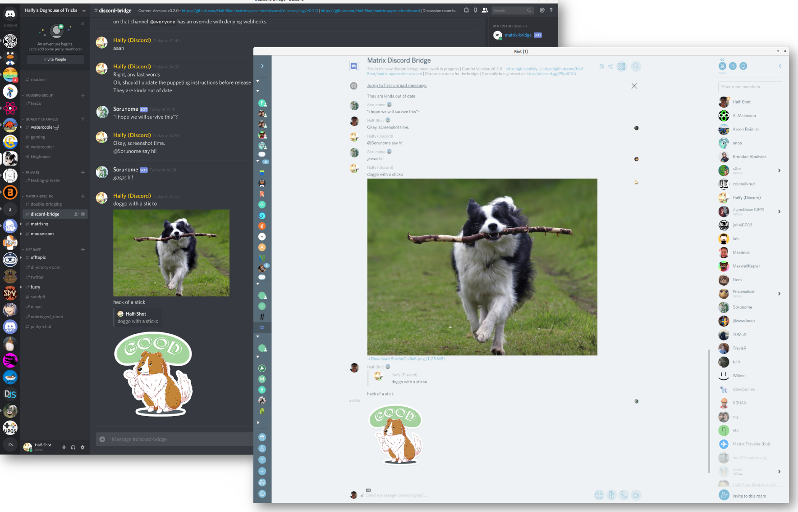

# Matrix Discord Bridge

A bridge between [Matrix](http://matrix.org/) and [Discord](https://discord.com/).
Currently the bridge is in **Beta** and quite usable for everyday
bridging, with one or two bugs cropping up.




## Helping out


[](https://travis-ci.org/Half-Shot/matrix-appservice-discord)
[](https://hub.docker.com/r/halfshot/matrix-appservice-discord)
[](https://matrix.to/#/#discord:half-shot.uk)

### PRs
PRs are graciously accepted, so please come talk to us in [#discord-bridge:matrix.org](https://matrix.to/#/#discord-bridge:matrix.org)
about any neat ideas you might have. If you are going to make a change, please merge it with the `develop` branch :).

### Issues
You can also file bug reports/ feature requests on Github Issues which also helps a ton. Please remember to include logs.
Please also be aware that this is an unoffical project worked on in our spare time.

## Setting up

The bridge has been tested against the [Synapse](https://github.com/matrix-org/synapse) homeserver, although any homeserver
that implements the [AS API](https://matrix.org/docs/spec/application_service/r0.1.0.html) should work with this bridge.

The bridge supports any version of Node.js between v14.X - v18.X. View the [releases](https://nodejs.org/en/about/releases/) for more details.

The bridge uses Yarn for dependency management and package scripts.
For the time being, **only Yarn Classic / v1 is supported.** To install it, follow [these instructions](https://classic.yarnpkg.com/en/docs/install).

If you already have Yarn 2+ installed, you may configure just this project to use Yarn Classic
by running ``yarn set version classic`` in the directory where you cloned this repository.

### Set up the bridge

* Run ``yarn`` to grab the dependencies.
* Copy ``config/config.sample.yaml`` to ``config.yaml`` and edit it to reflect your setup.
  * Note that you are expected to set ``domain`` and ``homeserverURL`` to your **public** host name.
  While localhost would work, it does not resolve correctly with Webhooks/Avatars.
  Please note that a self-signed SSL certificate won't work, either.

  ```yaml
  bridge:
      domain: "example.com"
      homeserverUrl: "https://example.com"
  ```

* Run ``node build/src/discordas.js -r -u "http://localhost:9005" -c config.yaml``
* Modify your HSs appservices config so that it includes the generated file.
  * e.g. On synapse, adding to ``app_service_config_files`` array in ``homeserver.yaml``

  ```yaml
  app_service_config_files:
    - "discord-registration.yaml"
  ```

  * Copy ``discord-registration.yaml`` to your Synapse's directory.

#### Docker

Following the instructions above, generate a registration file. The file may also be hand-crafted if you're familiar with the layout. You'll need this file to use the Docker image.

```shell
# Create the volume where we'll keep the bridge's files
mkdir -p /matrix-appservice-discord

# Create the configuration file. Use the sample configuration file as a template.
# Be sure to set the database paths to something like this:
#  database:
#    filename: "/data/discord.db"
#    userStorePath: "/data/user-store.db"
#    roomStorePath: "/data/room-store.db"
nano /matrix-appservice-discord/config.yaml

# Copy the registration file to the volume
cp discord-registration.yaml /matrix-appservice-discord/discord-registration.yaml

# Optional: Build the container yourself (requires a git clone, and to be in the root of the project)
docker build -t halfshot/matrix-appservice-discord .

# Run the container
docker run -v /matrix-appservice-discord:/data -p 9005:9005 halfshot/matrix-appservice-discord
```
#### Metrics

The bridge supports reporting metrics via Prometheus. You can configure metrics support in the config
file. The metrics will be reported under the URL provided in the registration file, on the `/metrics` endpoint.

#### 3PID Protocol Support

This bridge support searching for rooms within networks via the 3pid system
used in clients like [Element](https://element.io). Any new servers/guilds you bridge
should show up in the network list on Element and other clients.

### Setting up Discord

* Create a new application via https://discord.com/developers/applications
* Make sure to create a bot user. Fill in ``config.yaml``
* Run ``yarn addbot`` to get a authorisation link.
* Give this link to owners of the guilds you plan to bridge.
* Finally, you can join a room with ``#_discord_guildid_channelid``
  * These can be taken from the url ("/$GUILDID/$CHANNELID") when you are in a channel.
  * Element (and other clients with third party protocol support) users can directly join channels from the room directory.
* You can use Webhooks to make messages relayed by the bridge not nested by the bot user. This will also display the avatar of the user speaking on matrix with their messages.
  * The bot should create this automatically, but if not perform the following:
    * Enable ``Manage Webhooks`` on the role added by the bot.
    * Add the ``_matrix`` Webhook for each channel you'd like to enable this feature on.

### Running the Bridge

* For the bot to appear online on Discord you need to run the bridge itself.
* ``yarn start``
* Particular configuration keys can be overridden by defining corresponding environment variables. For instance, `auth.botToken` can be set with `APPSERVICE_DISCORD_AUTH_BOT_TOKEN`.

[Howto](./docs/howto.md)

## End User Documentation

### Bridging a Room

You must get an authorization link from bridge owner. You must be a server admin or get
help from server admin on Discord side.

* Invite the Matrix side bot to your room and wait for it to join.
* On Discord side use the authorization link to invite bot to Discord server.
* Find out a serverid and channelid for your server/channel you want to bridge. Search the web for instructions.
* In Matrix room give command ``!discord bridge ServerID ChannelID``
* The bridge will ask for confirmation from the Discord server admins to complete the bridge. Once approved, you're all set.

### Unbridging a Room

* In Matrix room give command ``!discord unbridge``

## Features and Roadmap
In a vague order of what is coming up next

 - Matrix -> Discord
     - [x] Text content
     - [x] Image content
     - [x] Audio/Video content
     - [ ] Typing notifs (**Not supported, requires syncing**)
     - [x] User Profiles
 - Discord -> Matrix
     - [x] Text content
     - [x] Image content
     - [x] Audio/Video content
     - [x] Typing notifs
     - [x] User Profiles
     - [x] Presence
     - [x] Per-guild display names.
 - [x] Group messages
 - [ ] Third Party Lookup
    - [x] Rooms
    - [ ] Users
 - [ ] Puppet a user's real Discord account.
    - [x] Sending messages
    - [ ] Direct messages
    - [ ] UI for setup
 - [x] Rooms react to Discord updates
 - [ ] Integrate Discord into existing rooms
    - [x] Feature
    - [ ] UI
 - [ ] Manage channel from Matrix (possibly)
    - [ ] Authorise admin rights from Discord to Matrix users
    - [ ] Topic
    - [ ] Room Name
 - [ ] Provisioning API
 - [x] Webhooks (allows for prettier messages to discord)
 - [ ] VOIP (**Hard** | Unlikely to be finished anytime soon)


## Contact

My Matrix ID: [@Half-Shot:half-shot.uk](https://matrix.to/#/@Half-Shot:half-shot.uk)
